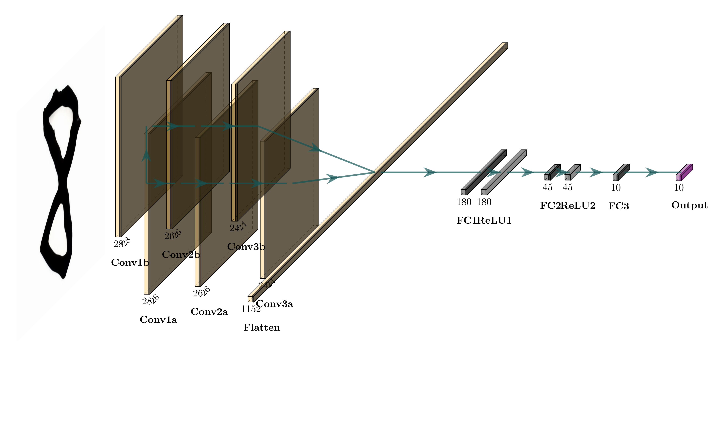

# 基于CNN的手写数字识别
本项目的卷积神经网络使用C语言构建，包括前向传播和反向传播，可对手写数字体进行有效识别

# 介绍
* 数据集使用[MNIST数据集](http://yann.lecun.com/exdb/mnist/)中的一小部分数据，大小为30x30，通道数为2，包含300张训练集与10张测试集
* 网络结构包括双通道的三层卷积和单通道的三层全连接。
* 卷积操作使用的kernel为3x3，最后输出24x24的特征图；
* 全连接首先将双通道的特征图扁平化到1x1152，而后降维到180->45->10，最后利用softmax输出10种类别的概率



# 环境依赖
* GCC 11.4.0

# 编译与运行
## 编译
```bash
./compile.sh
```
# 测试结果
```bash
./CNN_Improved.bin
训练数据读取成功
开始训练网络
请问您是否希望从已训练的网络参数文件中读取网络参数？(是请按y，否请按n): n
参数初始化完毕！
请输入预训练的次数：10
开始训练
        进入train函数
训练进度: 100.000000%  交叉熵损失: 0.077078  学习率:0.0002557282
```

# 演示
https://github.com/IammyselfYBX/Handwritten-digit-recognition-based-on-CNN/assets/56785746/2f545cbf-ce66-45ed-b5eb-db71066e79de

